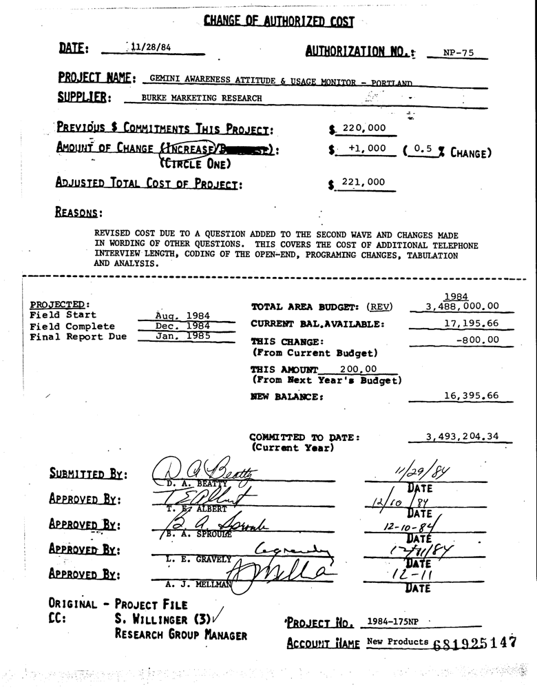
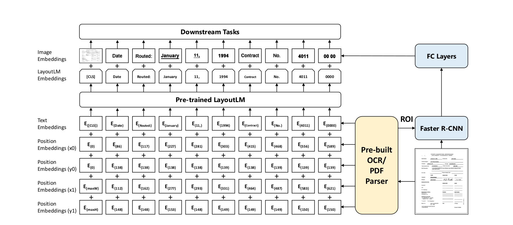

The past few years have seen pre-trained NLP models flourish considerably. These models focus exclusively on text data.
Lately, much focus has been placed on visually rich documents and multimodal learning.
Text and visual information are learnt jointly in order to process documents.
This is called document intelligence.
These models can be used to analyse business documents such as invoices, receipts and contracts.

There are two types of information conveyed in visually rich documents: the document layout information, that is to say the relative position of words in the document, and visual information such as bold, underline and italic.  
An example of this type of model is LayoutLM (2020). LayoutLM is based on the BERT architecture, with two extra input embeddings: 2-D position embedding and image embedding. 2-D position embedding aims to model the relative spatial position of words in a document. It uses the bounding box of each token (x and y coordinates of the top left and bottom right corners). An embedding table is used for x coordinates and another for y coordinates. The image embedding is generated by applying a Faster R-CNN on the pieces of images corresponding to the words detected by OCR as well as the whole document. It is used in the fine-tuning stage.
The illustration below represents the architecture of the model.

This repository hosts fine-tuning notebooks of the LayoutLM model.